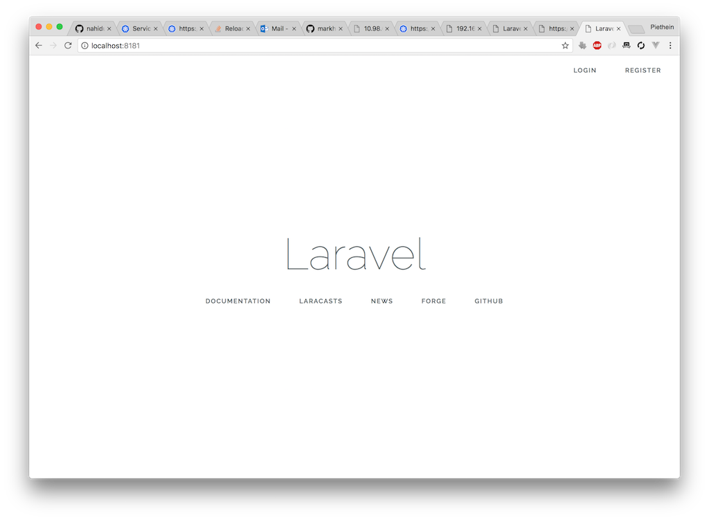
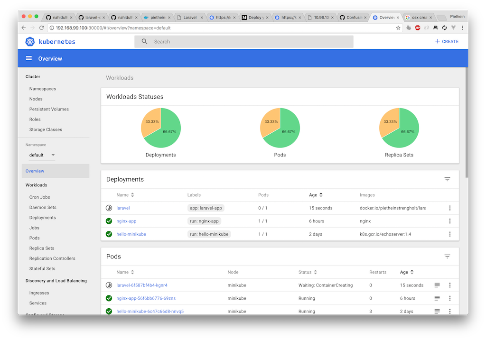
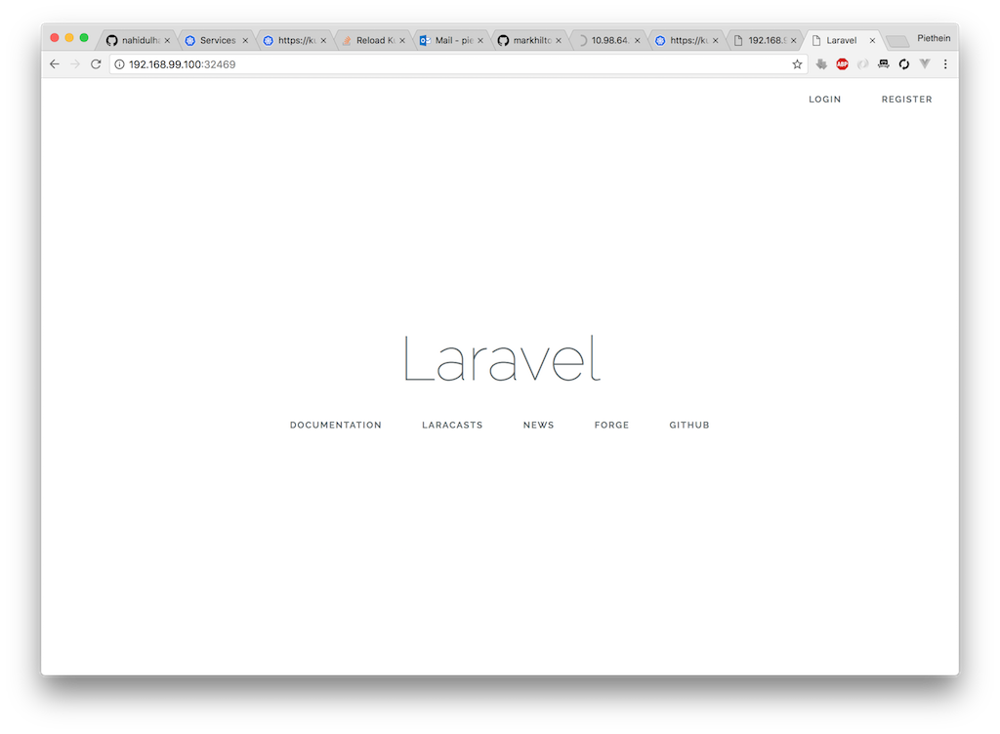

# laravel-docker-kubernetes

Kubernetes is an open-source system for automating deployment, scaling, and management of containerized applications. I'm using this personal repository as an attempt to package and run Laravel using Docker and deploy it on Kubernetes. In this tutorial I'm using Minikube, which is a tool that makes it easy to run Kubernetes locally. Minikube runs a single-node Kubernetes cluster inside a VM on your laptop for users looking to try out Kubernetes or develop with it day-to-day. I'll be also using Docker Hub, which is a Docker repository to let you share images with other co-workers or developers.

This repository is a copy of the laravel-docker-k8s from [nahidulhasan](https://github.com/nahidulhasan/laravel-docker-k8s), but since I'm going to adjust it heavily I think it is better to copy than to fork.

### Build and run the docker image from the project folder

Start the tutorial by cloning the current repository by using the following command:

``` 
git clone https://github.com/pietheinstrengholt/laravel-docker-k8s
```
 
After cloning the repository, enter the root of the directory and run the following command from your terminal. This command requires you to have Docker installed. You can install the Docker client by using the instructions from this [link](https://docs.docker.com/). The command below builds the Docker image using this repository.

```sh
docker-compose build
```

The next step is to start the project, by starting the Docker image just created. Use the following command to start the image:

```sh
docker-compose up -d
```

If the image works correctly you should be able to open the following webpage. Make sure port 8181 is not used by any other application. You should see the 'Laravel' page if everything works fine. See the screenshot below:

```
http://localhost:8181/
```


 
### Build the image and push to Docker Hub

The next step is that we will create a new Docker image, which will be pushed to the Docker Hub. The Docker Hub is a repository that hosts images from many different projects. Building and pushing an image allows us to pull in an image to Kubernetes at a later stage. Perform the following command to build the image:

```sh
docker build . -f ./deploy/dockerfile -t laravel-on-k8s:v1
```

Before pushing the image make sure you are logged into the Docker Hub. Run the command below to login. If you not have a Docker account please sign up using the this [link](https://hub.docker.com/).

```
docker login
```

Next step is to tag and label the image before pushing it to the Docker Hub repostory. I'm using my own credentials here, so if you want to use your own credentals change the pietheinstrengholt username. The laravel-on-k8s is repository name. v1 is the tag name.

```
docker tag laravel-on-k8s:v1 docker.io/pietheinstrengholt/laravel-on-k8s:v1
```

The final and last step is to upload the image. Upload the image by using the following command:

```
docker push docker.io/pietheinstrengholt/laravel-on-k8s:v1
```

Go to the hub.docker.com and validate that the image has been uploaded correctly. If so, we can continue with Kubernetes.

### Deploy the project using Kubernetes (Minikube)

For this part we will be using Minikube. Minikube is a local Kubernetes instance. If you don't have Minikube installed, please us the following [link](https://kubernetes.io/docs/tasks/tools/install-minikube/). If you have Minikube installed correctly, start Minikube by using the following command:

```
minikube start
```

The next step is that we start pulling in the image from the Docker Hub. If you want to use your own image, change the following file: deploy/app/deploy.yml
There should be a line with the following content. Change this line using your own credentials name.

```
image: docker.io/pietheinstrengholt/laravel-docker-k8s:v1
```

Next step is to pull in the image. Do this by executing the following commands:

```
kubectl apply -f deploy/app/secret.yml
kubectl apply -f deploy/app/deploy.yml
kubectl apply -f deploy/app/service.yml
``` 

Next step is to open the MiniKube dashboard and validate if the image has been pulled in correctly. Use the following command:

```
minikube dashboard
```

Your default webbrowser will open a new tab using the following url:

```
http://192.168.99.100:30000/#!/overview?namespace=default
```

See the screenshot below:



We can also validate the status by using the commandline. Run the following command:

``` 
kubectl get service
```

A table should show up with the following conent:

NAME     |     TYPE      |     CLUSTER-IP  |  EXTERNAL-IP   |  PORT(S)   |     AGE
---------|---------------|-----------------|----------------|------------|----------
hello-minikube  |  NodePort  |  10.98.64.133  |  <none>  |  8080:30271/TCP  |  2d
kubernetes  |  ClusterIP  |  10.96.0.1  |  <none>  |  443/TCP  |  2d
laravel-project  |  NodePort  |  10.105.178.73  |  <none>  |  80:32469/TCP  |  10m
nginx-http  |  ClusterIP  |  10.100.126.245  |  <none>  |  80/TCP  |  20h

The laravel project should be listed here between the different other images. 

You can also use the following command to get an detailed overview of the laravel service:

```
curl $(minikube service laravel-project --url)
```

Use the port name and open the browser to validate if the image is working accordingly:

```
http://192.168.99.100:32469/
``` 

See the screenshot below of Laravel running now on Kubernetes:



In case you want to debug, you can use the following command to see the events generated by Kubernetes:

```
kubectl get events
```

### TODO
- Add MySQL instances
- Add AWS & Azure Services
- Replace Laravel 5.4 with latest
- Run the images straight from the docker.io hub:

```
kubectl run --image=docker.io/pietheinstrengholt/laravel-docker-k8s:v1 laravel-docker-k8s --port=8181 --env="DOMAIN=cluster"
kubectl expose deployment laravel-docker-k8s --port=8181 --name=laravel-docker-k8s
```

### Extra Note :

> - If you want to use different database or different port etc, You should alter the docker-compose.yml file.

> - If you modify the .env file, you should run the following command:

```  
base64 -b -i deploy/env/.env
```

> - Running the command you will get base 64 encoded string. Put the string in deploy\app\secret.yml. And then run the commands for deploying.